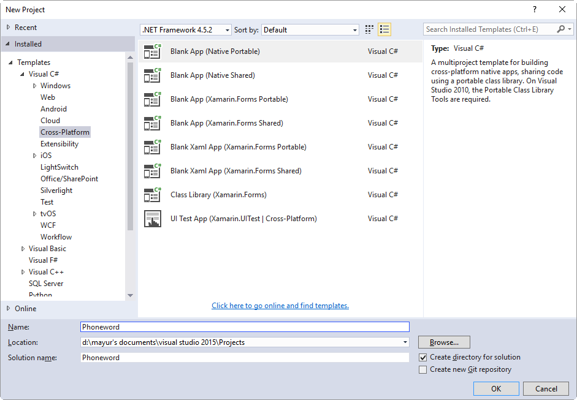
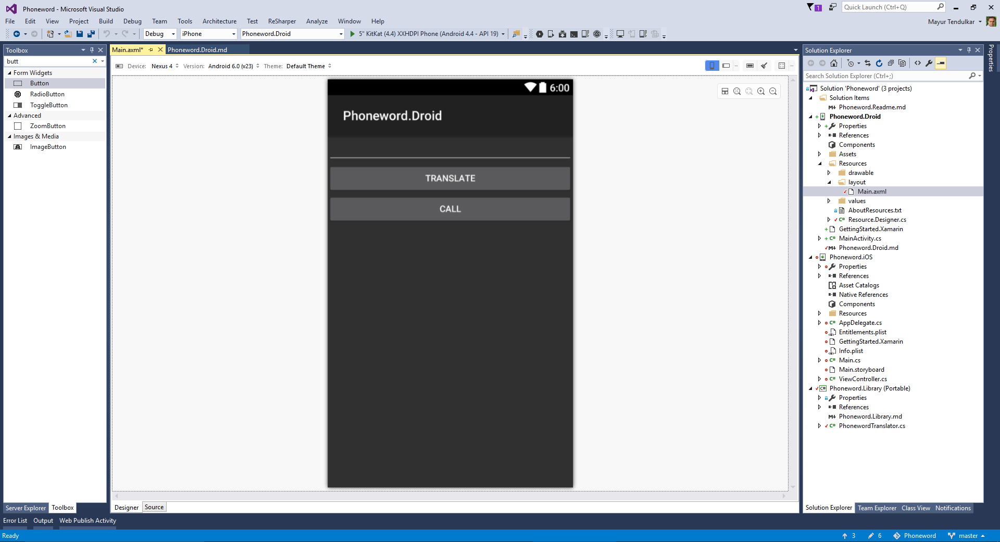

#### Phoneword - 'Hello World' for Mobile Developers

When someone starts to learn programming, the first chapter is always a 'Hello World', be it printing it in C/C++, displaying it in HTML web page or popup message box in desktop application. 
As this lab is aimed for mobile applications, let's build a mobile app which will make use phone functionality and make a phone call.

#### Overview

This lab will cover creating an Android & iOS apps for making a phone call. 

#### Requirements

This lab requires Xamarin components installed on Mac or on Windows. 

#### Building Phoneword App

Create a cross-platform 'Blank App (Native Portable)'. This will create projects for Portable Class Library, Android and iOS. 



Now, let's build these projects individually. 

#### Phoneword (Portable Class Library)

- Open MyClass.cs from Phoneword (PCL) and rename it to PhonewordTranslator.cs 
- Also rename the class
- In the class add following code

```csharp
public static class PhonewordTranslator
{
	public static string ToNumber(string raw)
	{
		if (string.IsNullOrWhiteSpace(raw))
			return "";
		else
			raw = raw.ToUpperInvariant();

		var newNumber = new StringBuilder();
       foreach (var c in raw)
		{
			if (" -0123456789".Contains(c))
				newNumber.Append(c);
			else {
				var result = TranslateToNumber(c);
              if (result != null)
					newNumber.Append(result);
			}
           // otherwise we've skipped a non-numeric char
		}
       return newNumber.ToString();
}


	static bool Contains (this string keyString, char c)
	{
		return keyString.IndexOf(c) >= 0;
	}

	static int? TranslateToNumber(char c)
	{
		if ("ABC".Contains(c))
			return 2;
		else if ("DEF".Contains(c))
			return 3;
		else if ("GHI".Contains(c))
			return 4;
		else if ("JKL".Contains(c))
			return 5;
		else if ("MNO".Contains(c))
			return 6;
		else if ("PQRS".Contains(c))
			return 7;
		else if ("TUV".Contains(c))
			return 8;
		else if ("WXYZ".Contains(c))
			return 9;
		return null;
	}
}
```


#### Phoneword for Android

**Overview**

In this lab, attendees will build their first Android application which will translate the Phoneword and make a phone call. 

**Creating Phoneword.Droid Project**

There are three steps to complete this project

**Step 1: Creating User Interface**

- Open existing Phoneword.Droid project and locate Main.axml within Resources > Layout folder. 
- Use drag and drop feature to create user interface for Phoneword. 
- Add 'EditText' to enter the Phoneword. Name it as 'PhonewordText'
- Use 'Button' to translate this Phoneword to a valid phone number. Name it as 'TranslateButton' & set Text peroprty to 'Translate'
- Use Button to call this translated number. Name it as 'CallButton' & set the Text property to 'Call'
- The UI should look like this:



- The following code shows the code behind for this UI

```xml
<?xml version="1.0" encoding="utf-8"?>
<LinearLayout xmlns:android="http://schemas.android.com/apk/res/android"
    android:orientation="vertical"
    android:layout_width="match_parent"
    android:layout_height="match_parent"
    android:minWidth="25px"
    android:minHeight="25px">
    <EditText
        android:layout_width="match_parent"
        android:layout_height="wrap_content"
        android:id="@+id/PhonewordText" />
    <Button
        android:text="Translate"
        android:layout_width="match_parent"
        android:layout_height="wrap_content"
        android:id="@+id/TranslateButton" />
    <Button
        android:text="Call"
        android:layout_width="match_parent"
        android:layout_height="wrap_content"
        android:id="@+id/CallButton" />
</LinearLayout>
```

**Step 2: Adding code behind**

-Add a reference to Phoneword (Library) to Android Project
- In MainActivity.cs write following code above constructor. 

```csharp
 EditText phoneNumberText;
 Button translateButton;
 Button callButton;
 string TranslatedNumber; 
```
- In constructor, set the layout file and assign controls to these variables. Along with it, set event handlers for the button.

```csharp
SetContentView (Resource.Layout.Main);
phoneNumberText = FindViewById<EditText>(Resource.Id.PhonewordText);
translateButton = FindViewById<Button>(Resource.Id.TranslateButton);
callButton = FindViewById<Button>(Resource.Id.CallButton);
```

- Using the PhonewordTranslator class in Phoneword.Library, translate the phoneword. This logic can be added in TranslateButton click event

```csharp
private void TranslateButton_Click(object sender, System.EventArgs e)
{
	TranslatedNumber = PhonewordTranslator.ToNumber(phoneNumberText.Text);
	if (string.IsNullOrWhiteSpace(TranslatedNumber))
	{
		callButton.Text = "Call";
		callButton.Enabled = false;
	}
    else
    {
		callButton.Text = "Call " + TranslatedNumber;
       callButton.Enabled = true;
	}
}
```
- Use TranslatedNumber to make phone call. Write that logic to make a phone call inside CallButton click event

```csharp
private void TranslateButton_Click(object sender, System.EventArgs e)
{
	TranslatedNumber = PhonewordTranslator.ToNumber(phoneNumberText.Text);
	if (string.IsNullOrWhiteSpace(TranslatedNumber))
	{
		callButton.Text = "Call";
		callButton.Enabled = false;
	}
    else
    {
		callButton.Text = "Call " + TranslatedNumber;
       callButton.Enabled = true;
	}
}
```
**Step 3: Running the app**

Android applications require permissions to execute tasks like making a phone call. Open 'Properties' of the application and give permission to call.


Now run the app and see it in action.

#### Phoneword for iOS

**Overview**

In this lab, attendees will build their first iOS application which will translate the Phoneword and make a phone call. 

**Creating Phoneword.iOS Project**

There are three steps to complete this project

**Step 1: Creating User Interface**

- Open existing Phoneword.iOS project and locate Main.storyboard. Make sure Visual Studio is connected to Mac to load the storyboard and build the iOS project.
- Use drag and drop feature to create user interface for Phoneword. 
- Add 'Text Field' to enter the Phoneword. Name it as PhonewordText. Set the Text property to blank to empty the textbox.
- Use 'Button' to translate this Phoneword to a valid phone number. Name it as TranslateButton. Set the text to 'Translate'
- Use Button to call this translated number. Name it as CallButton & set the Text property to 'Call'
- The UI should look like this:


**Step 2: Adding code behind**

- Add a reference to Phoneword (Library) to iOS Project
- In ViewController.cs write following code above constructor. 

```csharp
 string translatedNumber = "";
```
- In ViewDidLoad() method, add following code

```csharp
base.ViewDidLoad();
TranslateButton.TouchUpInside += (object sender, EventArgs e) =>
{
   // Convert the phone number with text to a number
   // using PhoneTranslator.cs
   translatedNumber = PhonewordTranslator.ToNumber(
                    PhonewordText.Text);
// Dismiss the keyboard if text field was tapped
   PhonewordText.ResignFirstResponder();
};
```

- Use CallButton event handler to make a phone call to translated number.

```csharp
CallButton.TouchUpInside += (object sender, EventArgs e) => 
{
   // Use URL handler with tel: prefix to invoke Apple's Phone app...
   var url = new NSUrl("tel:" + translatedNumber);
   if (!UIApplication.SharedApplication.OpenUrl(url))
   {
      var alert = UIAlertController.Create("Not supported", "Scheme 'tel:' is not supported on this device", UIAlertControllerStyle.Alert);
      alert.AddAction(UIAlertAction.Create("Ok", UIAlertActionStyle.Default, null));
      PresentViewController(alert, true, null);
    }
};
```
**Step 3: Running the app**

Now run the app and see it in action.
